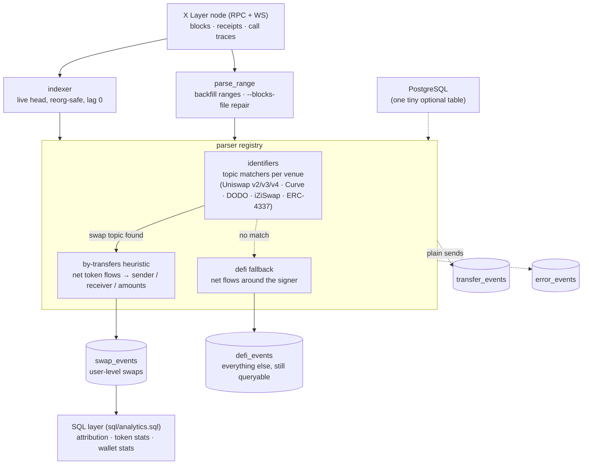

# xlayer-indexer

**The first user-level index of X Layer** — OKX's L2 ("The New Money Chain").

Explorers and raw-data platforms show *transactions*; this indexer reconstructs
*actions*: who traded what, across full history and in real time. It resolves the
**real economic actor** behind routers, aggregators, ERC-4337 bundlers and
custodial platform contracts — the layer that raw chain data (including
Dune's X Layer tables) does not provide.

Built during [OKX Dev Day 2026](https://luma.com/l4aq8vii) as the data layer for our
AI agent pipeline; released as a standalone open-source contribution to the X Layer
ecosystem.

## What it covers

| | |
|---|---|
| Swaps indexed | **24.4M** (full OP-era history, block 45,000,000 → tip) |
| Unique trading wallets | **508k** |
| Live indexing lag | **0 blocks** |
| Protocols | Uniswap v2 / v3 / v4, Curve, DODO, iZiSwap — incl. all forks (PotatoSwap, OkieSwap, ...) |
| Error rate | every unparsed tx recorded in `error_events` with a reason — nothing silently dropped |


## Requirements

| Component | Why |
|---|---|
| **Go 1.25+** | building the two binaries |
| **X Layer node** (RPC + WS) | blocks, receipts and call traces; standard op-geth serves the OP era (block 45,000,000 → tip) |
| **ClickHouse** | the event store — all parsed data lands here (`sql/schema.sql`) |
| **PostgreSQL** | one tiny auto-created table (optional parser overrides). Resume state is derived from ClickHouse itself; reorg tracking is in-memory. A stock `postgres:16` with an empty database is enough |

## Tables (ClickHouse)

The layout is a **funnel, not a filter** — every transaction gets a home on day one:

| Table | One row per | What it holds |
|---|---|---|
| `swap_events` | user-level swap | only fully-shaped swaps: base/quote, net amounts, `sender` (who paid), `receiver` (who got proceeds — may be a custodial router), `source` venue label. **The graduated, high-trust product.** |
| `defi_events` | any unrecognized smart-contract interaction | the universal catch-all: signer's net token inflows/outputs. Protocols we never heard of are still queryable (volumes, users, flows). When a category matters, graduate it into its own sibling table (`lending_events`, `bridge_events`, ...) by the same recipe as swaps — see [docs/ADDING_A_DEX.md](docs/ADDING_A_DEX.md) |
| `transfer_events` | plain token send | transfers with no contract logic behind them |
| `error_events` | failed parse attempt | `tx_hash` + human-readable reason. Nothing is dropped silently — this table is how we found and fixed whole missing classes (custodial routers) |

All event tables are `ReplacingMergeTree`: re-parsing any range is **idempotent** —
duplicates collapse in background merges. Re-run anything, any time.

## Philosophy: truth is in token movements

> Full version incl. the per-transaction decision tree: [docs/PHILOSOPHY.md](docs/PHILOSOPHY.md)

Most indexers decode protocol-specific event payloads. That breaks the moment a tx
goes through an aggregator, a custom router, a bundler, or a contract the indexer
has never seen.

This indexer treats **event topics only as triggers**. Amounts, direction, and the
actual user are derived from the *net token flows* of the transaction:

1. **Identifiers** match known swap-event topics anywhere in the receipt
   (topic-agnostic: no pool/router address lists to maintain — forks work day one).
2. The **by-transfers heuristic** reconstructs who *paid* what and who *received*
   what from ERC-20 transfers + native flows.
3. Special forms are handled explicitly:
   - **ERC-4337 bundles** are segmented per `UserOperationEvent` — each user op in a
     bundle becomes its own swap, attributed to the smart-account owner, not the bundler;
   - **relayed / solver-executed swaps** recover the sender via call-trace descent;
   - **custodial routers** (proceeds kept by the platform contract) are recognized,
     recorded, and the seller still gets correct attribution.

## Why data quality is existential for AI agents

Human analysts survive dirty data: they get suspicious, cross-check, discard
nonsense. LLM agents don't — they take whatever the query returns as ground
truth and confidently build conclusions on top. Bad indexing doesn't just
degrade agent analytics; it poisons it. That's why an agent-facing data layer
must resolve attribution, deduplicate, and collapse plumbing *before* the agent
sees a single row.

Example: ask an agent "who are the top traders on X Layer?" over raw event data
and it will name a Uniswap V4 PoolManager contract and a handful of routers —
then happily "analyze their trading strategy". (Before attribution, the
PoolManager was our #2 "trader" with 231k swaps.) Over this index, the same
question returns actual wallets — because routers, bundlers and custodial
contracts are resolved to the economic actor. The agent isn't wrong about the
data; the data is wrong about reality — unless the indexer fixes it first.

## Architecture



- `evm/cmd/indexer` — live indexer with reorg handling; resume point derived from indexed data, no separate state to babysit.
- `evm/cmd/parse_range` — batch backfill; `--blocks-file` mode parses an exact
  block list (9× faster for targeted repairs than range sweeps).
- `sql/schema.sql` — ClickHouse DDL (ReplacingMergeTree → idempotent re-parses;
  re-running any range is always safe).

> Full walkthrough incl. node flags and docker compose: [docs/DEPLOYMENT.md](docs/DEPLOYMENT.md)

## Running

```bash
cp .env.example .env        # fill in: node URLs, ClickHouse, Postgres DSN
clickhouse-client < sql/schema.sql
```

**Live indexing** (follows the chain head, handles reorgs; on restart resumes from the highest block already in ClickHouse):

```bash
go build -o bin/indexer ./evm/cmd/indexer
./bin/indexer
# progress:  curl localhost:19096/status   ->  {"chain":"xlayer","lag":0,...}
```

**Backfill** (historical ranges; run any number of workers over disjoint ranges):

```bash
go build -o bin/parse_range ./evm/cmd/parse_range
./bin/parse_range --start-block 45000000 --end-block 46000000
```

**Targeted repair** (exact block list — e.g. re-parse every block mentioned in
`error_events` after a parser improvement; ~9x faster than range sweeps):

```bash
clickhouse-client -q "SELECT DISTINCT block_number FROM evm.error_events WHERE chain='xlayer'" > blocks.txt
./bin/parse_range --blocks-file blocks.txt
```

Both tools are safe to interrupt and re-run (see idempotency note above).

**Adding a new DEX / venue:** one ~40-line identifier file — see
[docs/ADDING_A_DEX.md](docs/ADDING_A_DEX.md).

Note: X Layer migrated from zkEVM to the OP stack at block **45,000,000** — public
OP-stack nodes serve history from that block. Earlier history requires a zkEVM
archive node.

## Attribution in queries

Raw rows keep the mechanical sender/receiver. To resolve the human behind
infrastructure, join your infra-address labels and pick the first non-infra party —
example view in [`sql/schema.sql`](sql/schema.sql) comments:

`sql/analytics.sql` ships a starter pack: an `infra_labels` table you curate, the
attribution view over it, and token/wallet stats views:

```sql
clickhouse-client < sql/analytics.sql

SELECT wallet, swaps, tokens_traded FROM evm.v_wallet_stats
WHERE chain = 'xlayer' ORDER BY swaps DESC LIMIT 20;
```

Our hosted version layers curated infrastructure labels, physics-based bot
detection and win-rate smart-money selection on top of this exact schema — the
open mechanism here is the same one production runs on.

## License

Apache-2.0
